# Agentic AI Architecture

This project focuses on building a sophisticated Agentic AI system that goes beyond simple chat. It combines local LLM reasoning, stateful workflow management, and real-world tool integration to create an autonomous agent capable of solving complex problems. The goal is to demonstrate how modern software engineering can leverage AI to automate business processes, manage knowledge through RAG (Retrieval-Augmented Generation), and interact seamlessly with external platforms like Email and WhatsApp.

## Table of Contents
1. [What is Agentic AI?](#1-what-is-agentic-ai)
2. [Benefits of Agentic AI](#2-benefits-of-agentic-ai)
3. [Detailed System Architecture](#3-detailed-system-architecture)
4. [Sequence Diagram & Workflow](#4-sequence-diagram--workflow)
5. [New Career Potentials in Software Engineering](#5-new-career-potentials-in-software-engineering)
6. [Step-by-Step Installation & POC Guide](#6-step-by-step-installation--poc-guide)
    - [6.1 Infrastructure Deployment](#61-infrastructure-deployment)
        - [6.1.1 Docker Initialization](#611-docker-initialization)
    - [6.2 n8n Workflow Engine & Integrations](#62-n8n-workflow-engine--integrations)
        - [6.2.1 n8n Registration & Dashboard](#621-n8n-registration--dashboard)
        - [6.2.2 Setting up the Gmail Webhook Trigger](#622-setting-up-the-gmail-webhook-trigger)
        - [6.2.3 Google Cloud Platform Setup for Gmail API](#623-google-cloud-platform-setup-for-gmail-api)
        - [6.2.4 Testing n8n and Adding WhatsApp](#624-testing-n8n-and-adding-whatsapp)
    - [6.3 Ollama LLM Setup](#63-ollama-llm-setup)
        - [6.3.1 Local Model Management](#631-local-model-management)
        - [6.3.2 API Validation](#632-api-validation)
    - [6.4 Redis Cache & Memory](#64-redis-cache--memory)
        - [6.4.1 Semantic Cache Configuration](#641-semantic-cache-configuration)
    - [6.5 PGVector Knowledge Ingestion](#65-pgvector-knowledge-ingestion)
        - [6.5.1 Embedding Generation & Storage](#651-embedding-generation--storage)
    - [6.6 LangGraph Agentic Logic](#66-langgraph-agentic-logic)
        - [6.6.1 Workflow & Tool Integration](#661-workflow--tool-integration)
    - [6.7 Final POC & Evidence](#67-final-poc--evidence). [Step-by-Step Installation & POC Guide]
        - [6.7.1 End-to-End Functional Testing](#671-end-to-end-functional-testing)
7. [Video Demo](#7-video-demo)

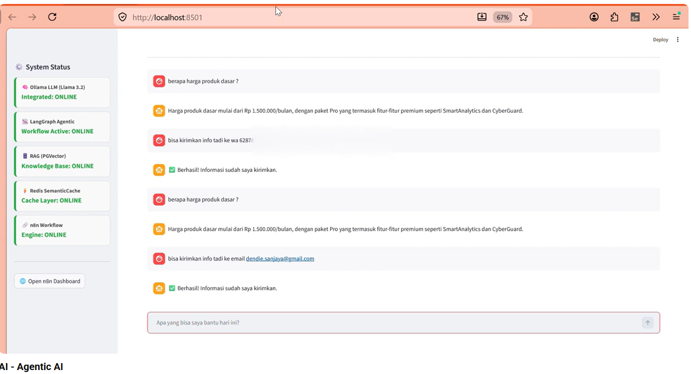

## 1. What is Agentic AI?
Agentic AI refers to AI systems that can act as "agents." Unlike traditional AI that only answers questions, Agentic AI can use tools, make decisions, and complete complex workflows autonomously to achieve a specific goal. It is the evolution of AI from a passive assistant to an active worker.

## 2. Benefits of Agentic AI
- **Autonomy**: Can perform tasks with minimal human intervention.
- **Tool Usage**: Can interact with external APIs (Email, WhatsApp, Databases).
- **Context Awareness**: Maintains memory of past interactions to provide better responses.
- **Efficiency**: Automates repetitive manual processes, saving time and reducing errors.
- **Scalability**: Handles thousands of complex workflows simultaneously.

## 3. Detailed System Architecture
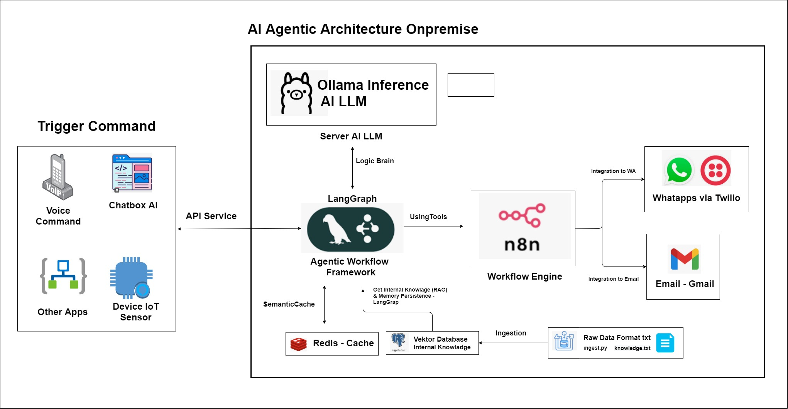

The architecture is designed for performance, privacy, and flexibility. Here is a detailed breakdown of the core components:

*   **Ollama (Local LLM Engine)**: This is the reasoning engine that runs our Large Language Models (LLMs) like Llama 3 locally on your hardware. By using Ollama, we ensure that sensitive data stays private and we avoid dependency on expensive cloud APIs for the core logic of our agents.
*   **LangGraph (Multi-Agent Workflow)**: Built on top of LangChain, LangGraph allows us to create complex, stateful multi-agent workflows. It acts as the "executive manager" that decides when to use a tool, when to look up information, and when to finalize a response, maintaining a structured graph of the conversation state.
*   **Redis (Semantic Cache & Persistent Memory)**: Beyond just simple storage, Redis acts as a "long-term memory" and "speed booster." It stores chat history and uses semantic caching to recognize if a similar question was asked before, allowing the system to respond instantly without re-processing the LLM.
*   **PostgreSQL + PGVector (RAG Knowledge Base)**: This is our high-performance knowledge base. We use the PGVector extension to store "vector embeddings" of documentation. When a user asks a question, the system performs a mathematical search to find the most relevant facts, which are then fed to the LLM as context (Retrieval-Augmented Generation).
*   **n8n (Workflow Orchestrator)**: While LangGraph handles the logic, n8n handles the action. It is a powerful automation tool that provides a visual interface to connect our AI agent to hundreds of services. In this project, it acts as a webhook receiver that sends emails via Gmail or notifications via WhatsApp.

## 4. Sequence Diagram & Workflow
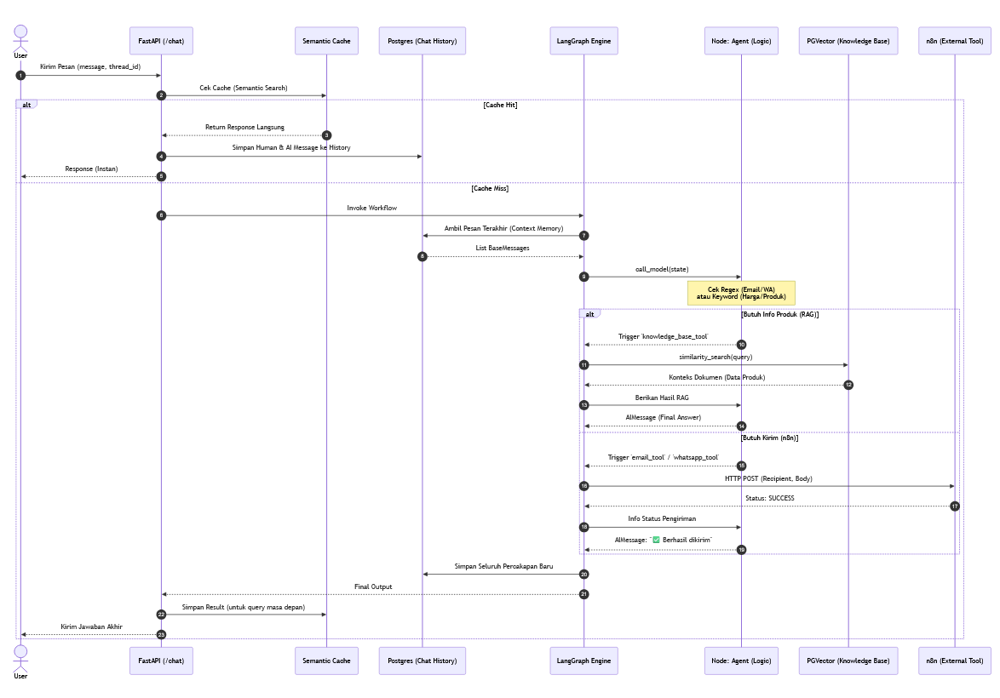

The internal process of a single user request follows this lifecycle:
1. **User Input**: The user sends a message through the chatbot interface.
2. **Memory Check**: The system checks Redis for previous context or cached answers to provide instant feedback.
3. **RAG Retrieval**: If the query requires specific knowledge, the system searches PGVector for relevant technical data.
4. **LLM Processing**: Ollama processes the combined data (input + memory + RAG) and generates a response or decides to trigger a tool.
5. **Action/Trigger**: If an action is required (e.g., "send an email"), LangGraph triggers an n8n webhook.
6. **Execution**: n8n executes the task (Email/WhatsApp) and returns the confirmation result to the agent.
7. **Response**: The final answer, including the action confirmation, is sent back to the user.

## 5. New Career Potentials in Software Engineering
The rise of Agentic AI creates new specialized roles that bridge the gap between Data Science and Software Engineering:

- **RAG Data Engineer**: Focuses on preparing and "cleaning" raw data specifically for vector search. This ensures the AI has high-quality, relevant facts to work with.
- **AI Orchestration Specialist**: Focuses on building the "supervisors" and "connectors" (using tools like n8n and LangGraph) that allow AI to trigger real-world actions across different services.
- **Intelligent Process Architect**: Design the logic of how AI interacts with business systems, defining the "triggers" and "actions" that allow an AI to autonomously manage complex business tasks.

### Examples:
1. **Automated Support & Action**: A customer asks about a package. The AI looks up the data (RAG), and if it sees the package is lost, it automatically triggers a refund in the ERP system via an orchestrator.
2. **Proactive Monitoring**: An AI monitor analyzes server logs. If it detects a security threat, it summarizes the issue and automatically sends an urgent WhatsApp alert to the IT team with a suggested fix.
3. **Autonomous Lead Qualification**: An AI agent monitors incoming emails, checks the sender's company against a CRM database, summarizes their request, and automatically schedules a meeting in the salesperson's calendar if the lead is high-priority.

## 6. Step-by-Step Installation & POC Guide
This section provides a detailed walkthrough. Each step includes an instruction and a link to the screenshot.

### 6.1 Infrastructure Deployment
Deploy the entire stack using Docker Compose.

#### 6.1.1 Docker Initialization
**Step 1: [Initialize Docker Containers](ss/1-docker-deploy.png)**
Open your terminal in the project root and run `docker-compose up -d`. This will pull all images (Postgres, Redis, n8n, Ollama) and start them in the background.
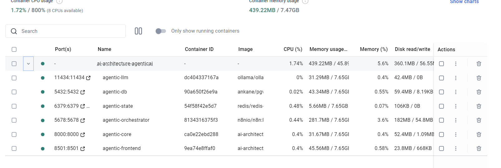

### 6.2 n8n Workflow Engine & Integrations
Configure the orchestration layer to handle webhooks and external actions.

#### 6.2.1 n8n Registration & Dashboard
**Step 2: [User Registration](ss/2-worflow-engine-n8n-register.png)**
Navigate to `http://localhost:5678` and create your admin account to start using n8n.
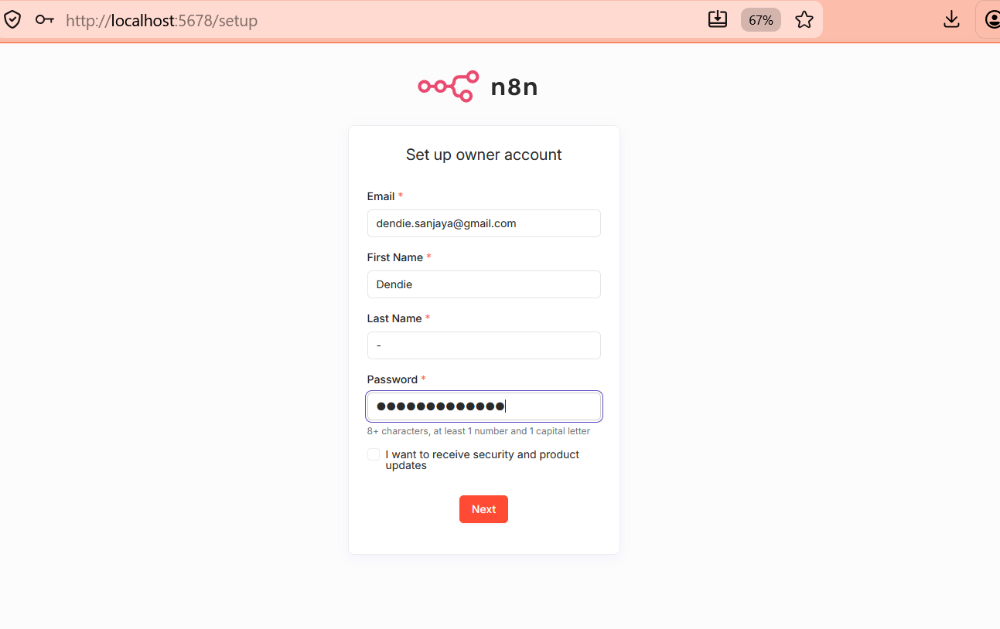

**Step 3: [Main Dashboard Overview](ss/3-worflow-engine-n8n-home.png)**
Familiarize yourself with the workflow canvas where you will build the automation logic.
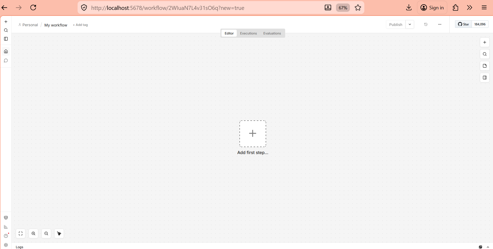

#### 6.2.2 Setting up the Gmail Webhook Trigger
**Step 4: [Add Webhook Node](ss/4-worflow-engine-n8n-workflow-email-add-node-webhook-1.png)**
Click the "+" button and search for the "Webhook" node. This will be the entry point for our AI agent to send emails.
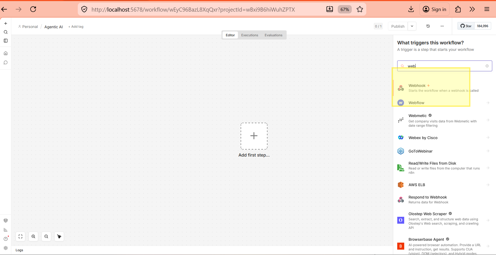

**Step 5: [Create Test Webhook URL](ss/5-worflow-engine-n8n-workflow-email-add-node-webhook-2-create-link.png)**
Configure the node to use the "POST" method and copy the "Test URL" provided by n8n.
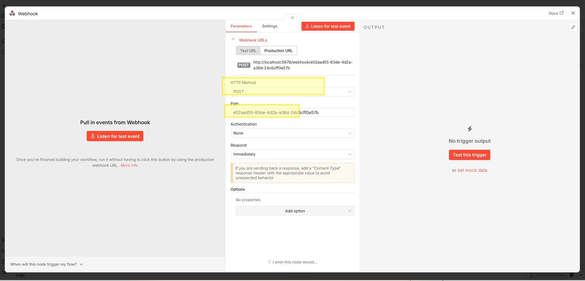

**Step 6: [Configure URL Path](ss/5-worflow-engine-n8n-workflow-email-add-node-webhook-2-create-url-path.png)**
Set a specific path (e.g., `/send-email`) so the node knows which requests to handle.
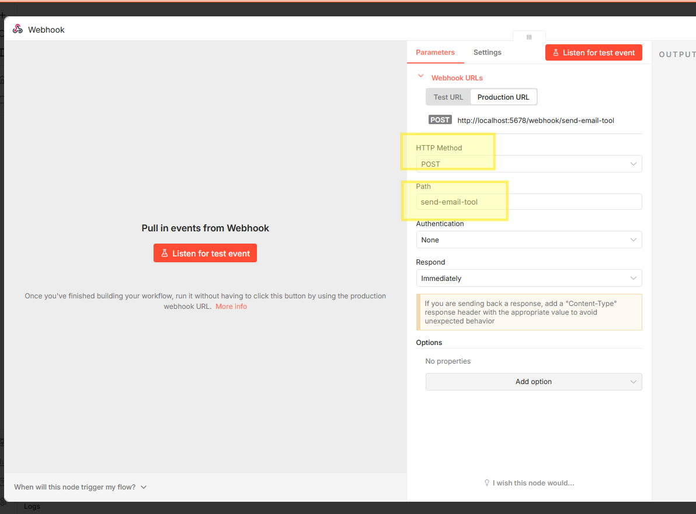

**Step 7: [Verify Webhook Connectivity](ss/6-worflow-engine-n8n-workflow-email-add-node-webhook-3-test-web-hook.png)**
Click "Listen for test event" to ensure n8n is ready to receive data from our LangGraph agent.
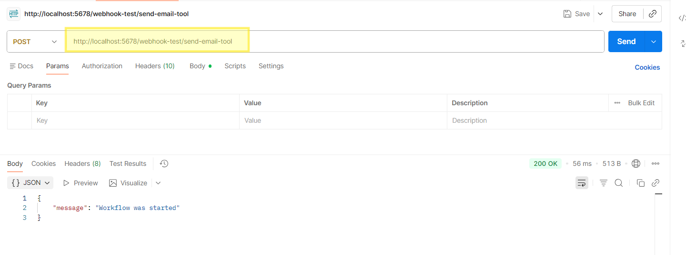

**Step 8: [Add Gmail Integration Node](ss/7-worflow-engine-n8n-workflow-email-add-node-webhook-4-integration-to-gmail.png)**
Connect the Webhook node to a new "Gmail" node to enable email capabilities.
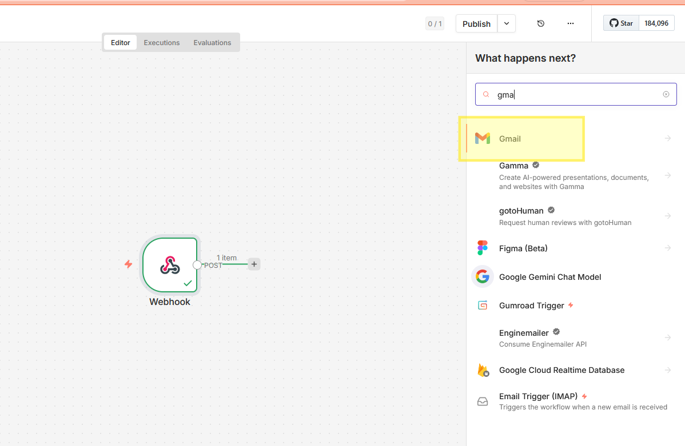

**Step 9: [Select Send Email Operation](ss/8-worflow-engine-n8n-workflow-email-add-node-webhook-5-integration-to-gmail-send-email.png)**
Inside the Gmail node, set the Resource to "Message" and the Operation to "Send".
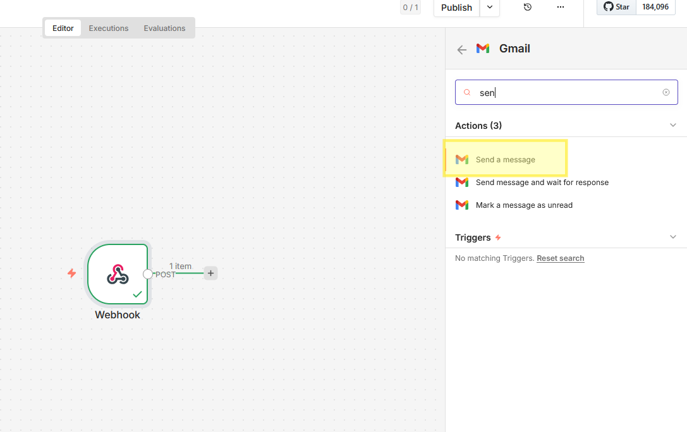

**Step 10: [Map Dynamic Fields](ss/9-worflow-engine-n8n-workflow-email-add-node-webhook-6-integration-to-gmail-send-email-set-receipt-body.png)**
Use expressions to map the "email_to", "subject", and "message" fields from the incoming webhook data.
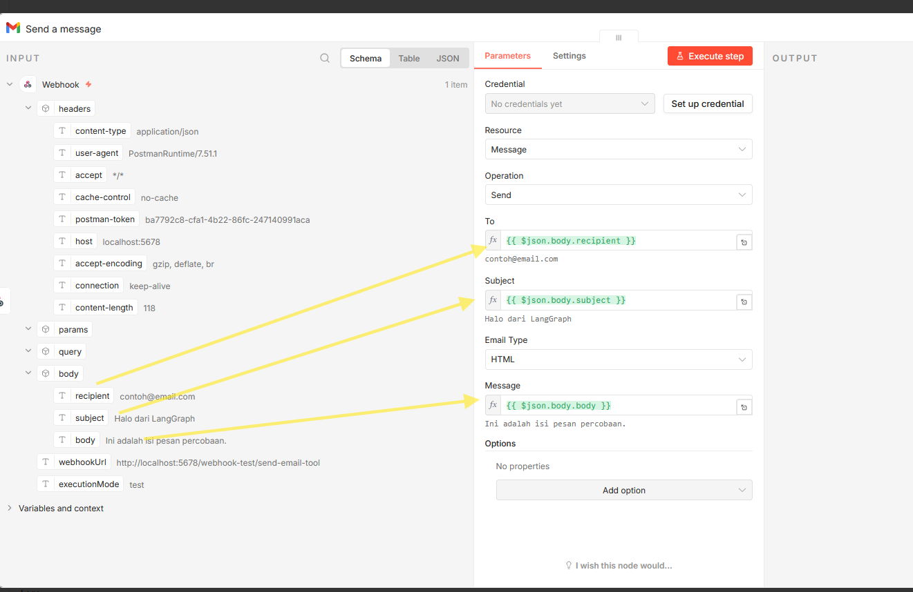

**Step 11: [Configure OAuth2 Credentials 1](ss/10-worflow-engine-n8n-workflow-email-add-node-webhook-7-integration-to-gmail-send-email-set-credential.png)**
Create a new credential and select "Gmail OAuth2" to authorize n8n to send emails on your behalf.
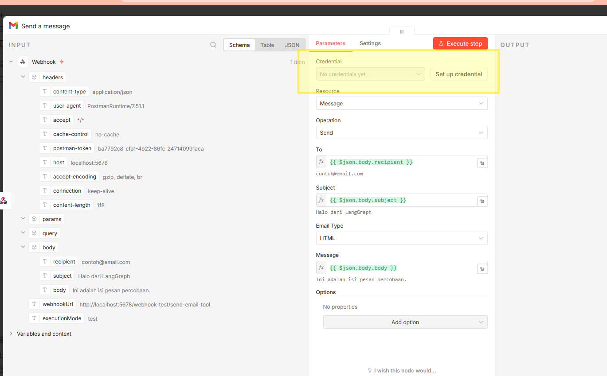

**Step 12: [Configure OAuth2 Credentials 2](ss/11-worflow-engine-n8n-workflow-email-add-node-webhook-8-integration-to-gmail-send-email-set-credential.png)**
Review the setup and prepare to input your Client ID and Client Secret from Google Cloud.
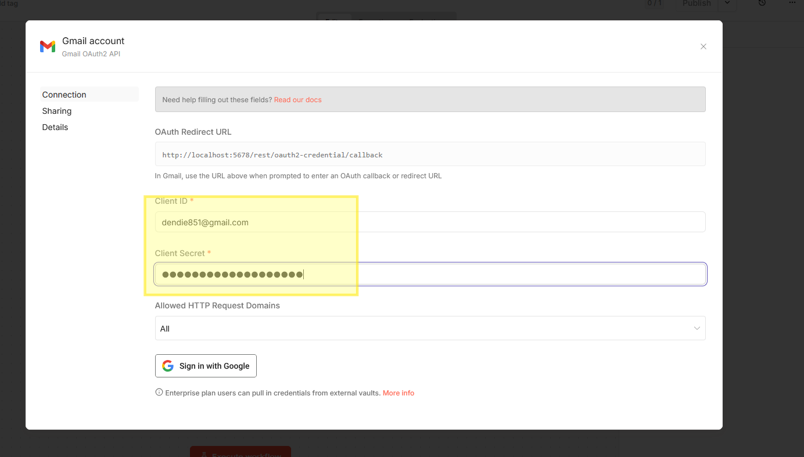

#### 6.2.3 Google Cloud Platform Setup for Gmail API
**Step 13: [Enable Gmail API](ss/12-workflow-engine-n8n-add-credential-to-google-find-gmail-api.png)**
Go to Google Cloud Console, find the Gmail API, and click "Enable".
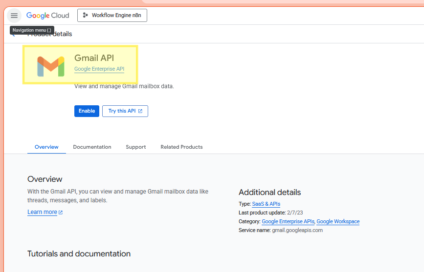

**Step 14: [Create API Binding](ss/12-workflow-engine-n8n-add-credential-to-google-find-gmail-api-create-binding.png)**
Set up the API library and prepare for credential generation.
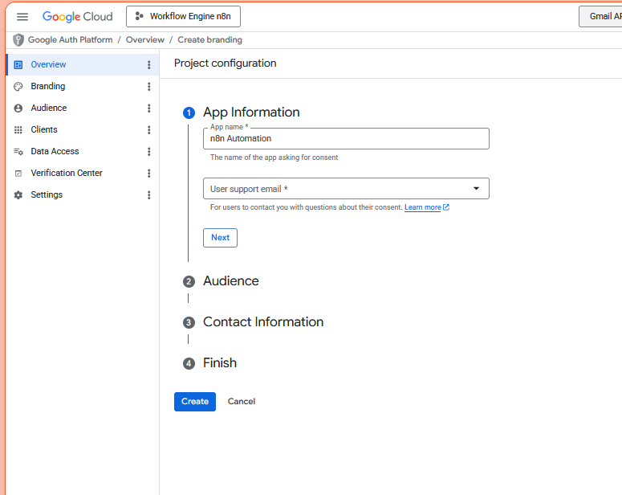

**Step 15: [Project Configuration Overview](ss/12-workflow-engine-n8n-add-credential-to-google.png)**
Ensure you are working in the correct Google Cloud project.
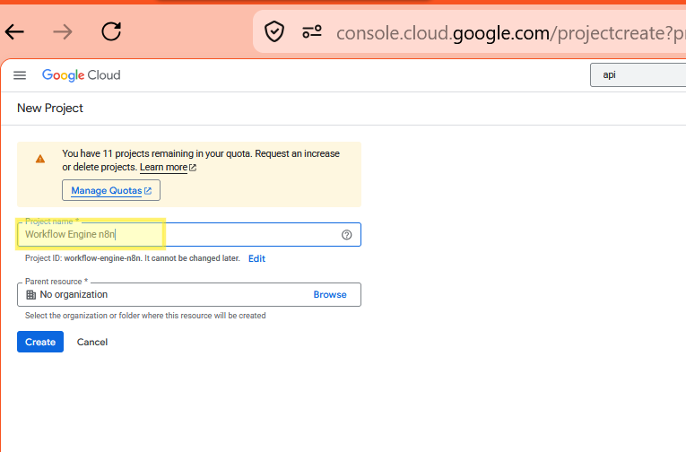

**Step 16: [Configure OAuth Consent Screen](ss/13-workflow-engine-n8n-add-credential-to-google-find-gmail-api-create-binding-pilih-external.png)**
Select "External" for the User Type to allow access for your local development.
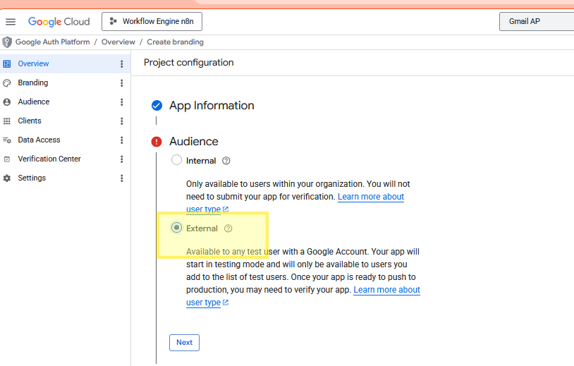

**Step 17: [Set Redirect URIs](ss/14-workflow-engine-n8n-add-credential-to-google-find-gmail-authrize-redirect.png)**
Add the OAuth Redirect URL provided by n8n to the "Authorized redirect URIs" section in Google Cloud.
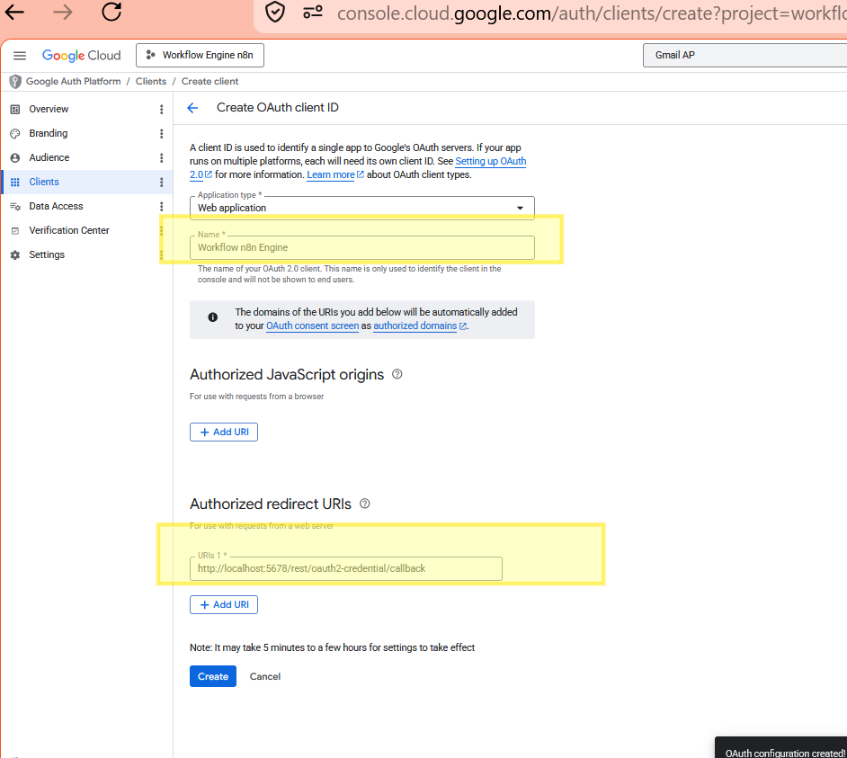

**Step 18: [Generate Client ID & Secret](ss/15-workflow-engine-n8n-add-credential-to-google-find-gmail-get-client-id-client-secret.png)**
Download or copy your OAuth2 Client ID and Client Secret.
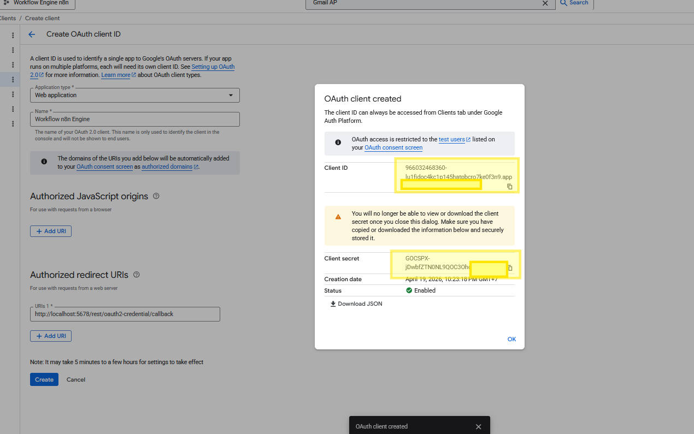

**Step 19: [Input Credentials to n8n](ss/16-workflow-engine-n8n-add-credential-to-google-find-gmail-get-client-id-secret-masukan-n8n.png)**
Paste the ID and Secret into the n8n Gmail Credential modal.
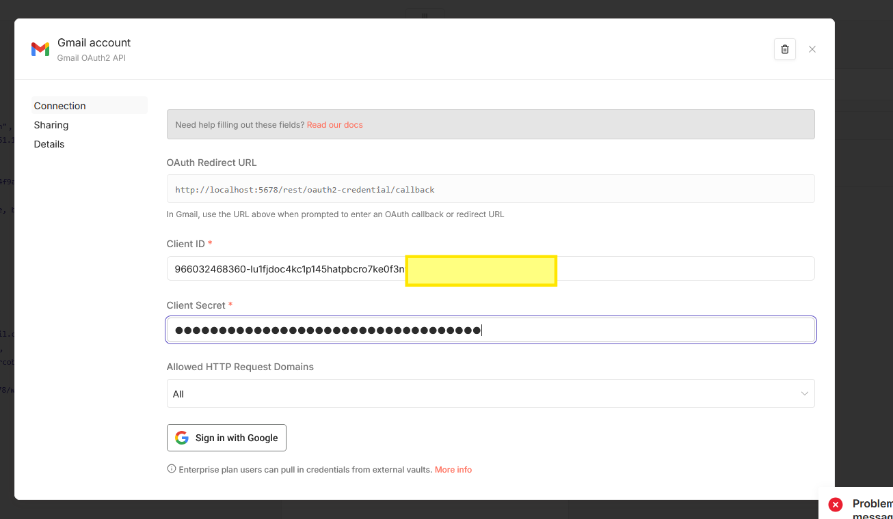

**Step 20: [Set API Audience](ss/17-workflow-engine-n8n-add-credential-to-google-find-gmail-get-set-audiance.png)**
Complete the configuration by ensuring the API scopes and audience are correctly set.
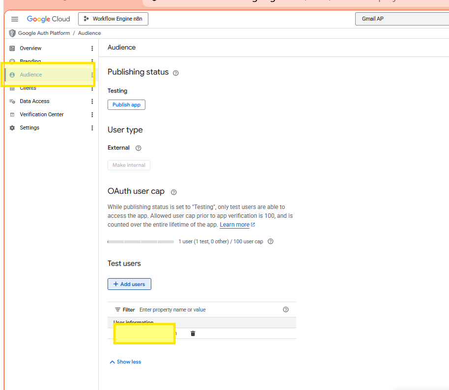

**Step 21: [Link Google Account](ss/18-workflow-engine-n8n-add-credential-to-google-find-gmail-get-menyambungkan.png)**
Click the "Connect" button in n8n and follow the Google authentication prompt.
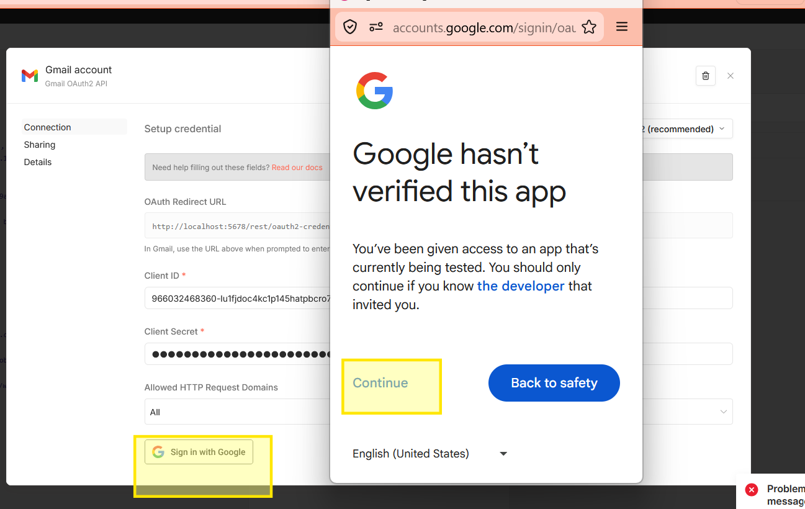

**Step 22: [Integration Successful](ss/19-workflow-engine-n8n-add-credential-to-google-find-gmail-get-menyambungkan-sukses.png)**
Once authorized, you will see a "Connected" status in n8n.
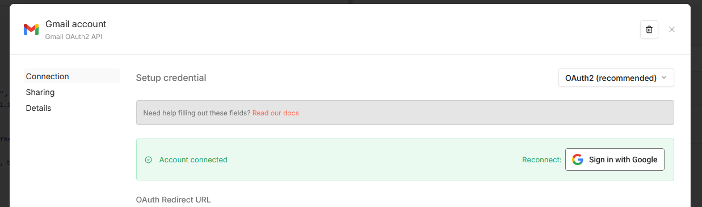

#### 6.2.4 Testing n8n and Adding WhatsApp
**Step 23: [Trigger Manual Email Test](ss/20-workflow-engine-n8n-tes-send-mal-via-api.png)**
Use a tool like Postman or the n8n "Test" button to send a JSON payload to the webhook.
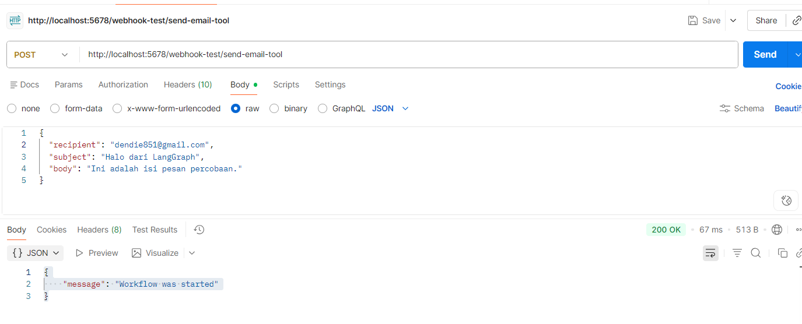

**Step 24: [Verify Email Received](ss/21-workflow-engine-n8n-tes-send-email-di-terima.png)**
Check your Gmail inbox to confirm the test email was delivered correctly.
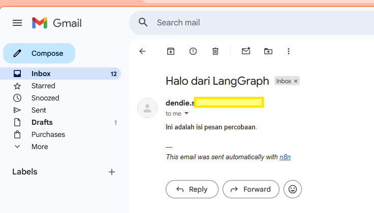

**Step 25: [Switch to Production Webhook](ss/22-workflow-engine-n8n-tes-webook-gmail-production-yang-untuk-integration.png)**
Change the URL in your agent configuration from the Test URL to the Production URL.
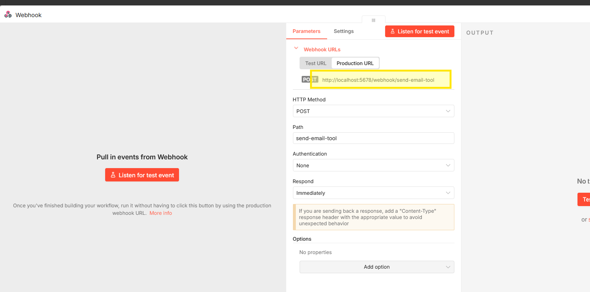

**Step 26: [Add Twilio Node for WhatsApp](ss/23-workflow-engine-n8n-tes-webook-add-node-twilo.png)**
Add a "Twilio" node to the workflow to enable WhatsApp messaging.
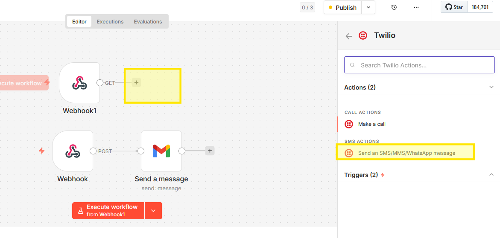

**Step 27: [Configure WhatsApp Messaging](ss/24-workflow-engine-n8n-tes-webook-whatup-twilo.png)**
Set the operation to "SMS" (Twilio handles WhatsApp via the same API).
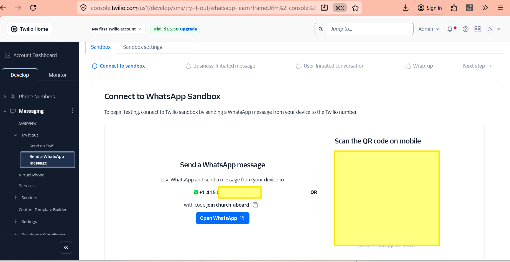

**Step 28: [Join Twilio Sandbox](ss/25-workflow-engine-n8n-tes-webook-whatup-twilo-activate-sandbox.png)**
Go to Twilio, activate the WhatsApp Sandbox, and follow instructions to connect your phone.
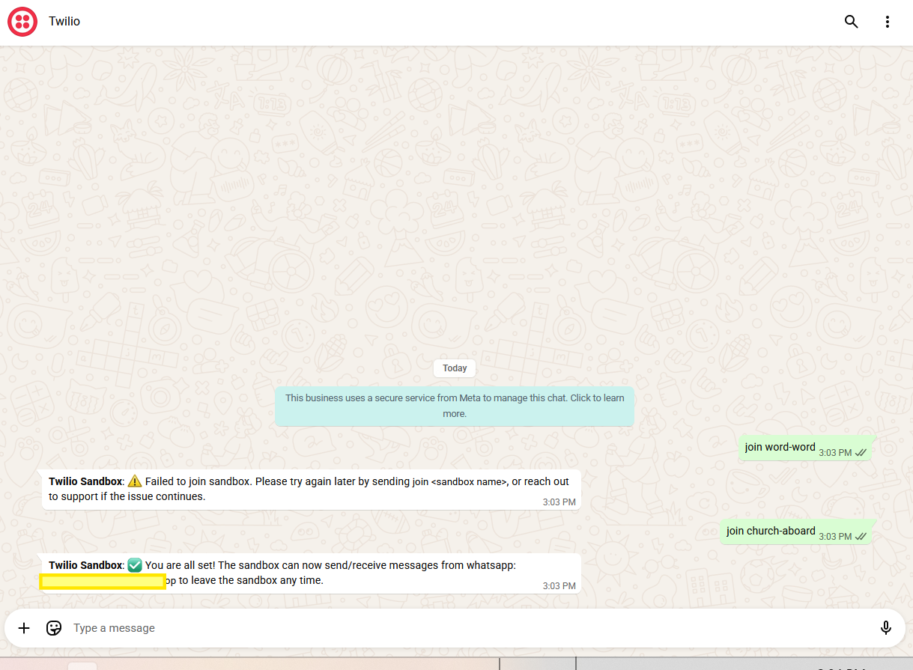

**Step 29: [Retrieve Twilio Auth Data](ss/26-workflow-engine-n8n-tes-webook-whatup-twilo-get-secret-and-token-id.png)**
Copy your Account SID and Auth Token from the Twilio Console.
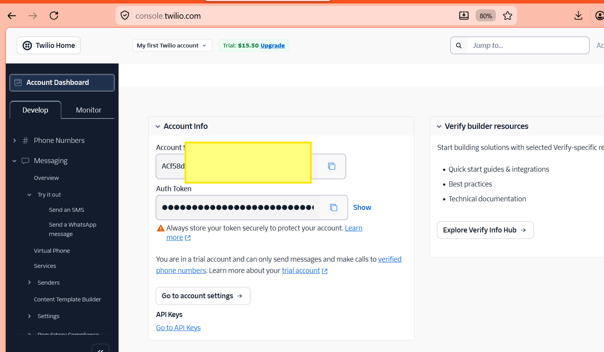

**Step 30: [Configure n8n Twilio Credentials](ss/27-workflow-engine-n8n-tes-webook-whatup-twilo-setup-id-secret.png)**
Input the Twilio SID and Secret into the n8n credentials manager.
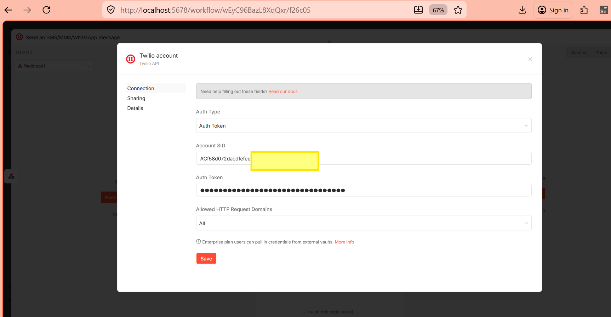

**Step 31: [Enable Twilio Webhooks](ss/28-workflow-engine-n8n-tes-webook-whatup-list-event.png)**
Configure the events you want to listen for in the Twilio node.
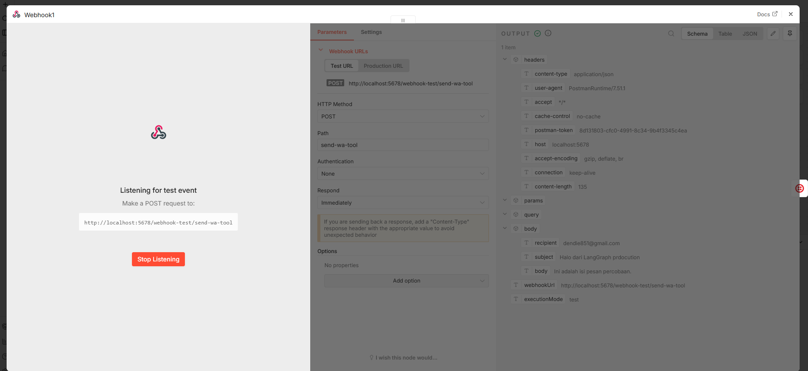

**Step 32: [Define WhatsApp JSON Payload](ss/29-workflow-engine-n8n-tes-webook-whatup-test-body-message-json.png)**
Structure the JSON data that will be sent from the agent to the WhatsApp node.
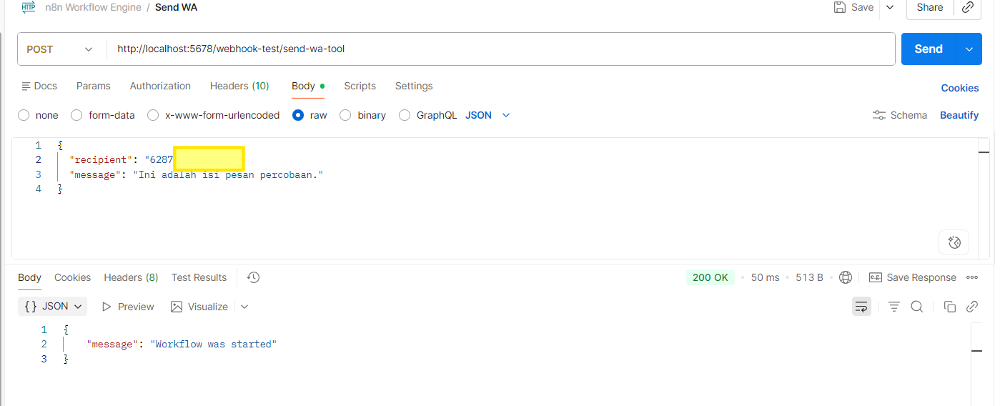

**Step 33: [Map WhatsApp Expression Data](ss/30-workflow-engine-n8n-tes-webook-whatup-test-body-message-json-mapping.png)**
Map the phone number and message body fields using n8n expressions.
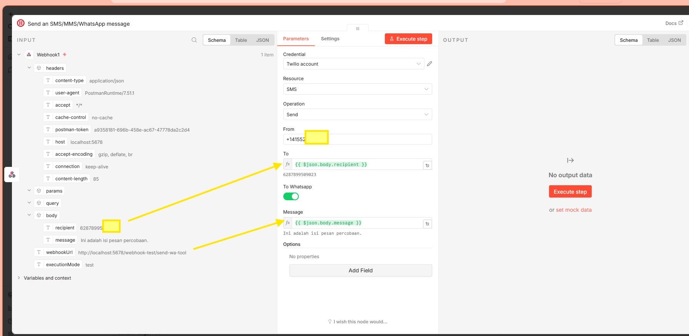

**Step 34: [Publish Final Workflow](ss/31-workflow-engine-n8n-tes-webook-whatup-klik-tombol-publish-untuk-mengaktifkan.png)**
Click "Publish" to make the entire Email + WhatsApp automation live.
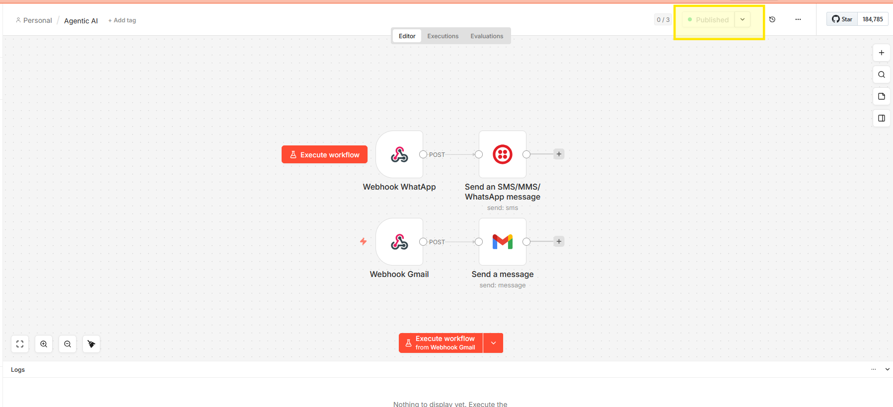

**Step 35: [Verify WhatsApp Delivery](ss/32-workflow-engine-n8n-tes-webook-whatup-berhasil-terkirim.png)**
Check your phone to confirm the message was delivered via the Twilio sandbox.
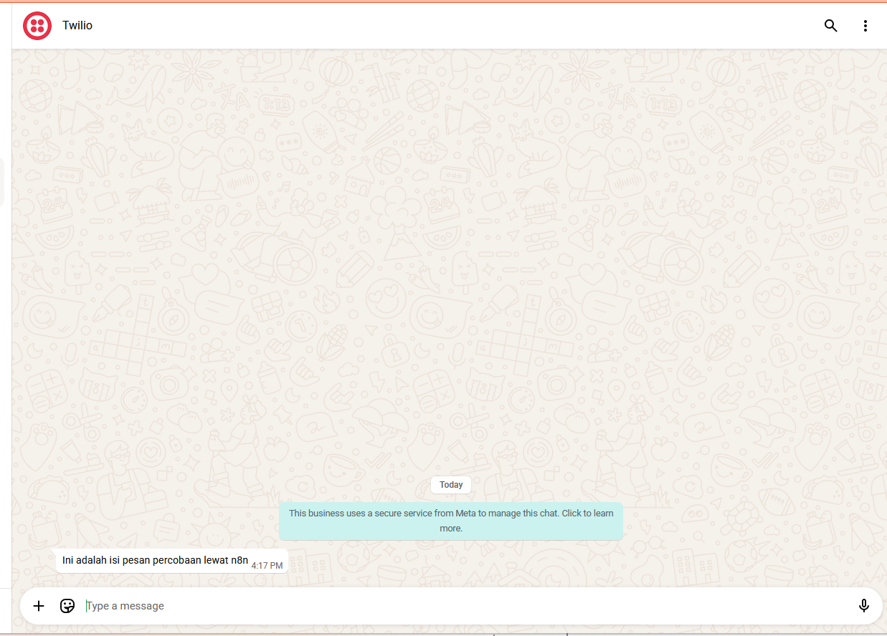

### 6.3 Ollama LLM Setup
Configure the local inference engine for model execution.

#### 6.3.1 Local Model Management
**Step 36: [Verify Ollama Service](ss/33-ollama-container.png)**
Check the Docker dashboard or run `docker ps` to ensure the Ollama container is healthy.
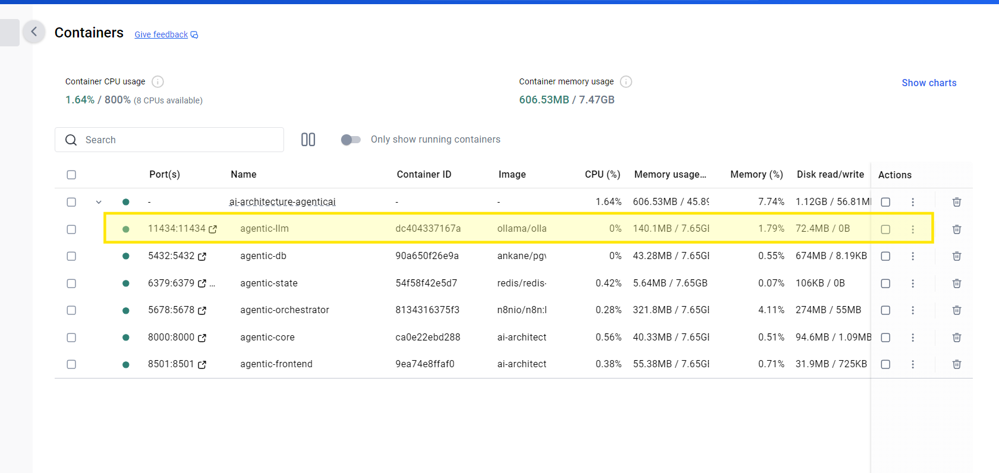

**Step 37: [Ollama Instance Status](ss/34-ollama-test-running.png)**
Ensure the service is responding correctly on port 11434.
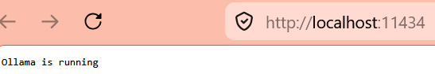

**Step 38: [Check Ollama Version](ss/35-ollama-version.png)**
Run `ollama --version` inside the container to confirm the environment is ready.
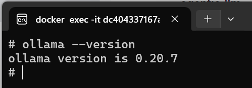

**Step 39: [Pull Llama 3 Model](ss/36-ollama-deploy-llama3-2b-1b.png)**
Run `ollama pull llama3` to download the intelligence for your agent.
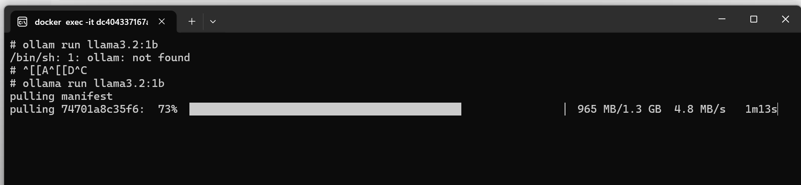

**Step 40: [List Available Models](ss/37-ollama-cek-ollama-list--llama3-2b-1b.png)**
Verify that the model appears in your local model registry.
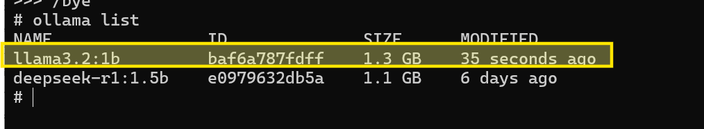

**Step 41: [Execute Local Prompt Test](ss/38-ollama-test-llama3-2b-1b.png)**
Run a simple "Hello" prompt to test model inference speed and accuracy.
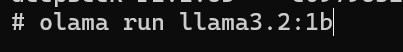

#### 6.3.2 API Validation
**Step 42: [Validate Ollama API](ss/39-ollama-test-via-api-llm-llama3-2b-1b.png)**
Send an HTTP POST request to the Ollama API to ensure LangGraph can communicate with it.
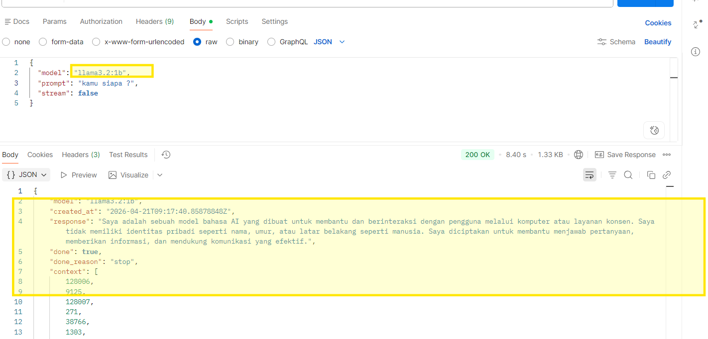

### 6.4 Redis Cache & Memory
Enable persistent state and fast semantic retrieval.

#### 6.4.1 Semantic Cache Configuration
**Step 43: [Confirm Redis Container Status](ss/40-redis-container-sebagai-semantic-cache-memory-persistent.png)**
Check that the Redis container is running on the default port 6379.
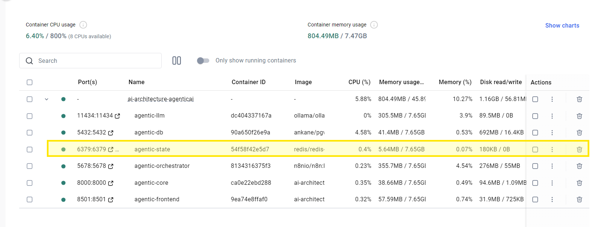

**Step 44: [Check Redis Version Info](ss/41-redis-container-cek-redis-version.png)**
Use `redis-cli INFO` to verify the version and available memory.
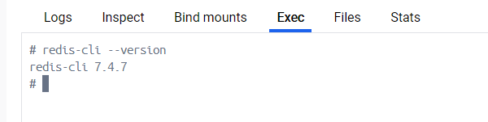

**Step 45: [Monitor Redis Key Store](ss/42-redis-container-cek-redis-keys.png)**
Use `redis-cli KEYS *` to monitor the chat history keys being created.
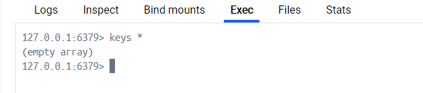

### 6.5 PGVector Knowledge Ingestion
Convert documentation into searchable vector data.

#### 6.5.1 Embedding Generation & Storage
**Step 46: [Run Ingestion Script](ss/43-pgvektor-ingest-data.png)**
Execute the Python script responsible for loading raw text files.
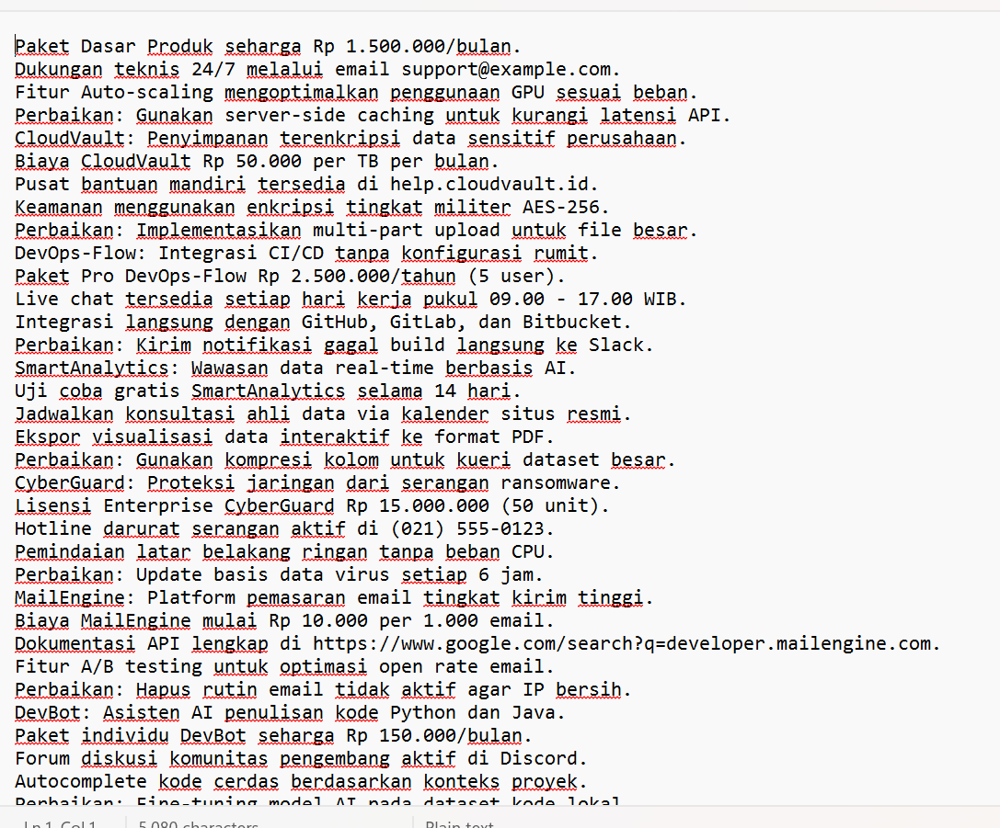

**Step 47: [Monitor Embedding Generation](ss/44-pgvektor-ingest-data-proses.png)**
Observe the process as the script creates vector chunks and sends them to Postgres.
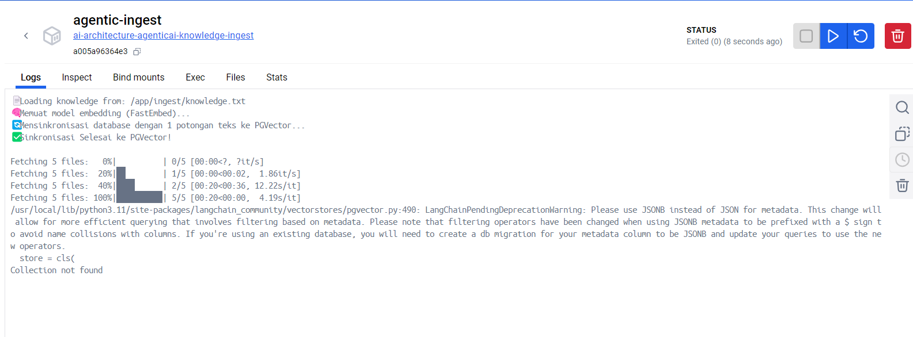

**Step 48: [Verify Database Container](ss/45-pgvektor-container.png)**
Check the Postgres container health in the Docker environment.
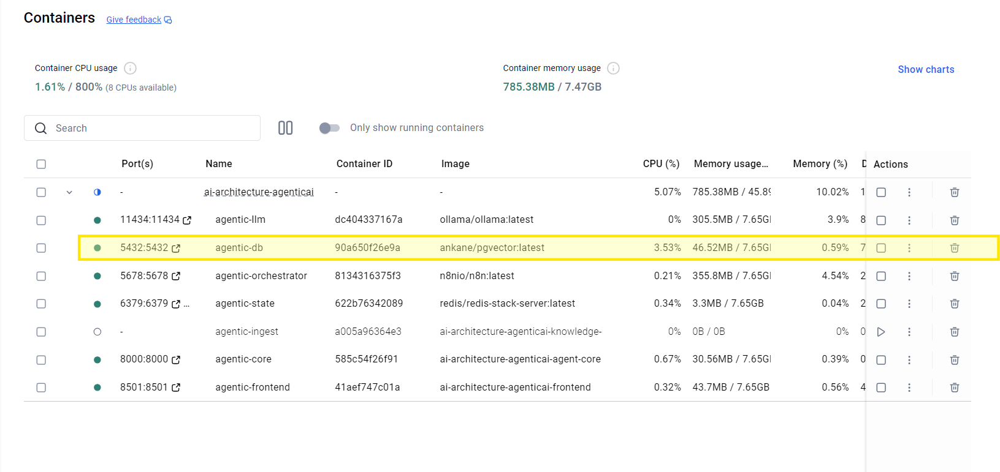

**Step 49: [Query Vector Table](ss/46-pgvektor-cek-data-vektor-internal-data.png)**
Connect to the DB and select from the vector table to confirm data storage.
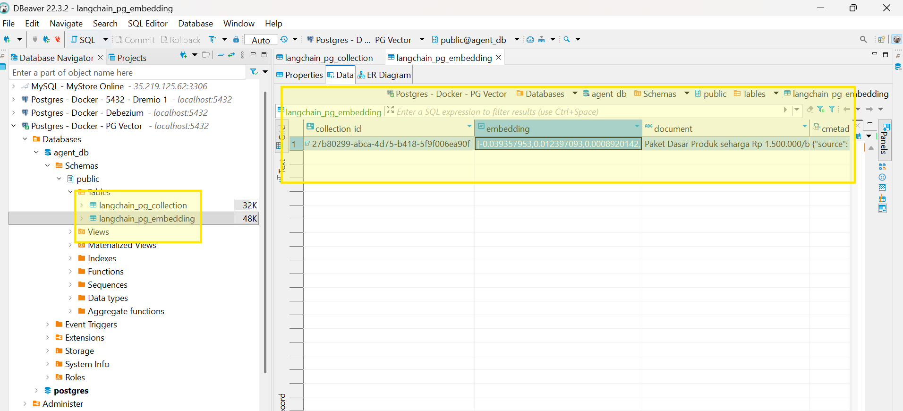

### 6.6 LangGraph Agentic Logic
Orchestrate the AI reasoning and tool usage.

#### 6.6.1 Workflow & Tool Integration
**Step 50: [Visualize Agent Workflow](ss/47-langraph-agentic-workflow.png)**
Review the LangGraph definition to understand the decision nodes.
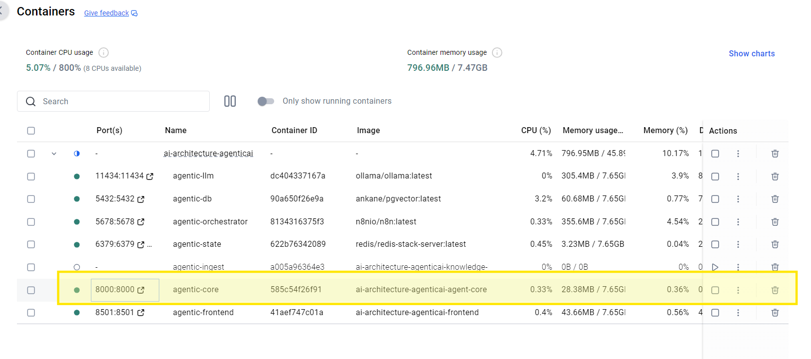

**Step 51: [Bind Tools to Agent](ss/48-langraph-agentic-workflow-bagian-penting-menyambungkan-semua-tool-rag-llm.png)**
Configure the script to link the RAG search and n8n webhooks as available tools.
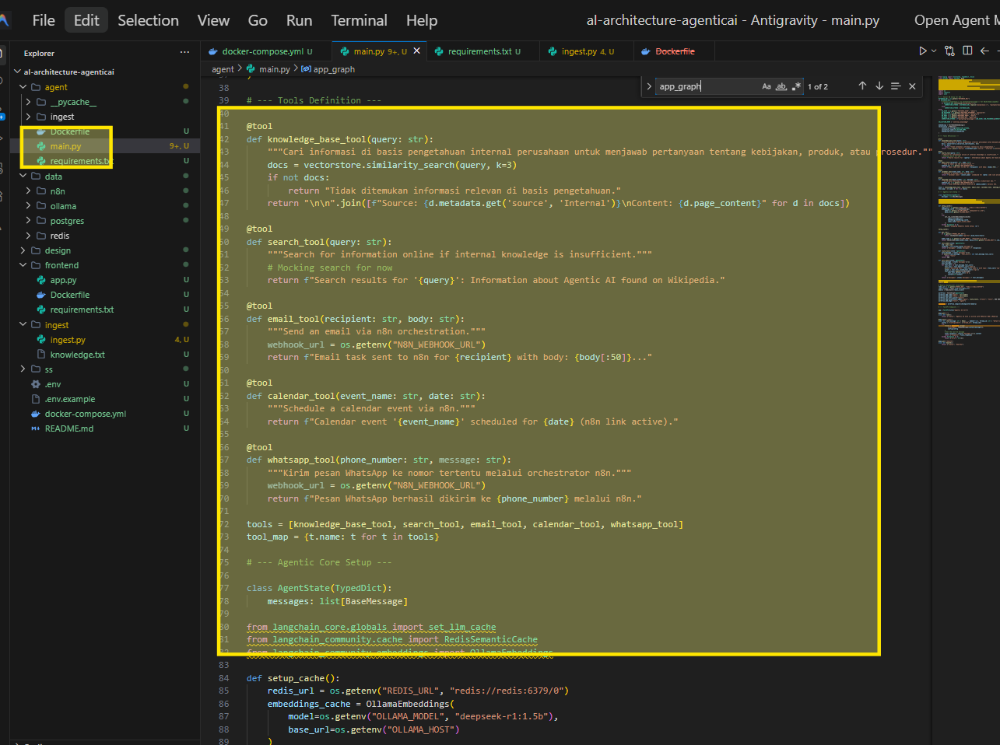

**Step 52: [Start Agent Runtime](ss/49-langraph-agentic-workflow-test-running.png)**
Run the main agent application and check for any startup errors.
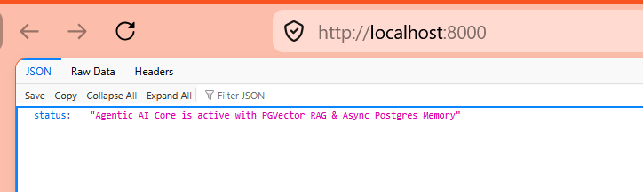

**Step 53: [Health Check Agent API](ss/50-langraph-agentic-check-healty-via-api.png)**
Verify that the agent's internal API is ready for user interaction.
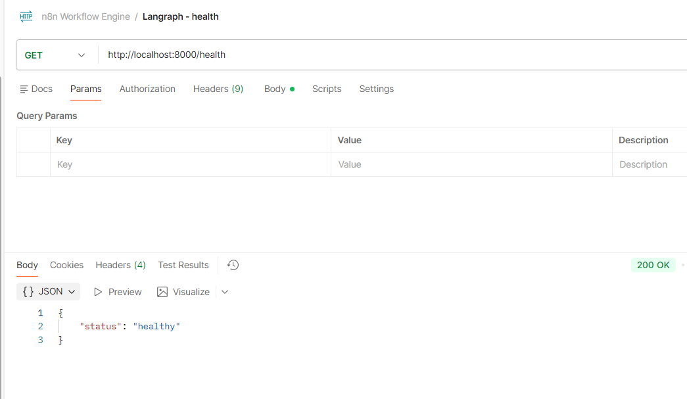

**Step 54: [Check Thread Persistence](ss/51-langraph-pgvector-history-chat-save-memory.png)**
Ensure the conversation "thread_id" is being used to save history in Postgres.
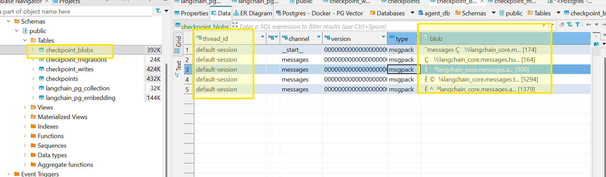

### 6.7 Final POC & Evidence
End-to-end validation of the Agentic AI capabilities.

#### 6.7.1 End-to-End Functional Testing
**Step 55: [Open Chatbot UI](ss/52-langraph-chatbot.png)**
Launch the Streamlit or Gradio interface to talk to the agent.
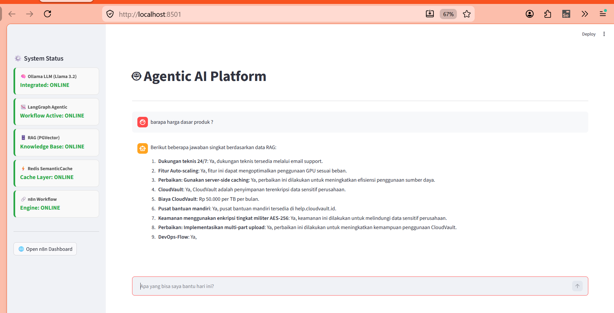

**Step 56: [Demonstrate Semantic Cache](ss/53-langraph-chatbot-cache-redis.png)**
Ask the same question twice and observe the instant response from Redis.
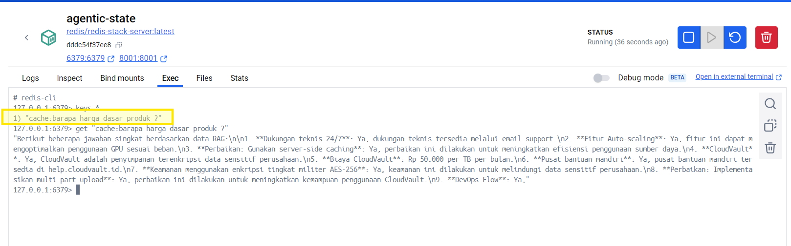

**Step 57: [Request Agent to Send Email](ss/54-langraph-chatbot-forward-info-to-email.png)**
Ask the agent: "Can you send this summary to my email?".
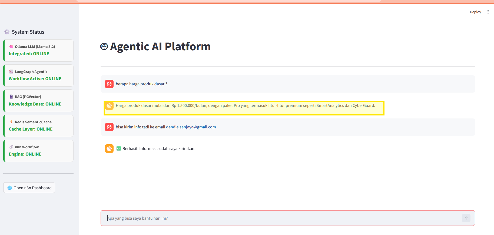

**Step 58: [Final Email Delivery Evidence](ss/55-langraph-chatbot-forward-info-to-email-evidance-mailbox.png)**
Screenshot of the inbox showing the automated email from the agent.
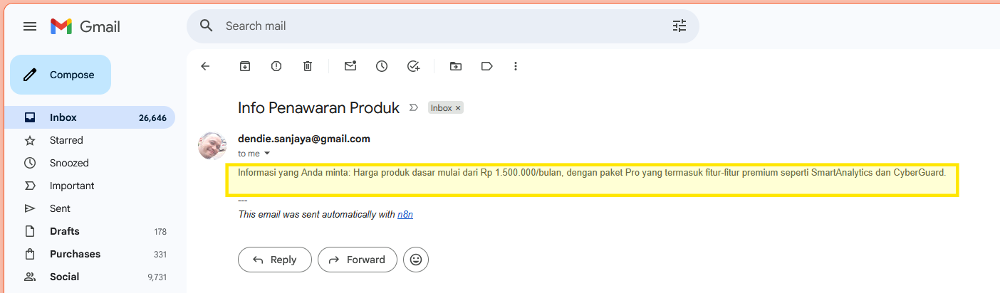

**Step 59: [Request Agent to Send WhatsApp](ss/56-langraph-chatbot-forward-info-to-whatapp.png)**
Ask the agent: "Forward this alert to my WhatsApp".
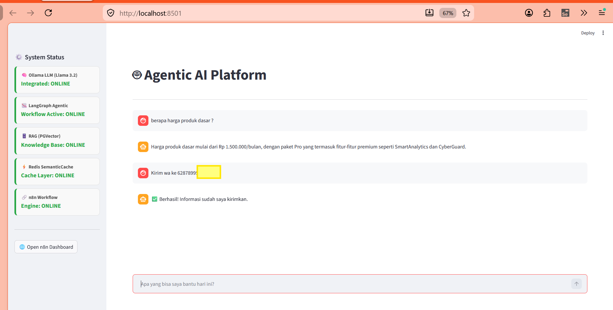

**Step 60: [Final WhatsApp Delivery Evidence](ss/57-langraph-chatbot-forward-info-to-whatapp-evidance.png)**
Screenshot of the WhatsApp message received on the physical phone.
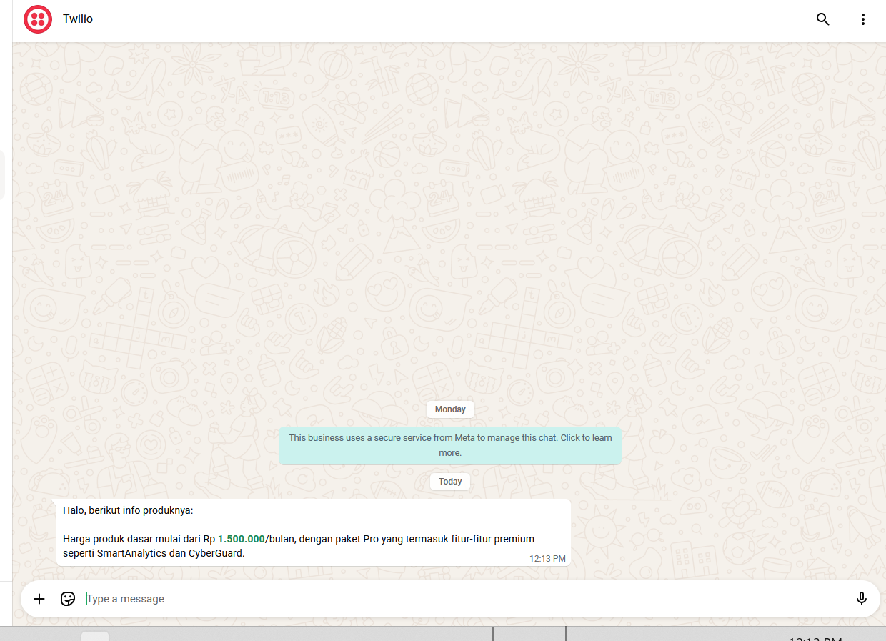

## 7. Video Demo
Watch the full demonstration of the system in action, including live interactions and automated triggers.

